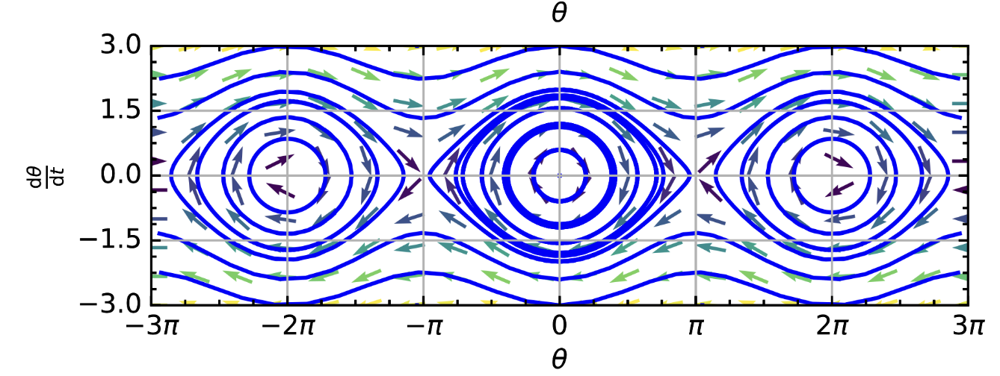
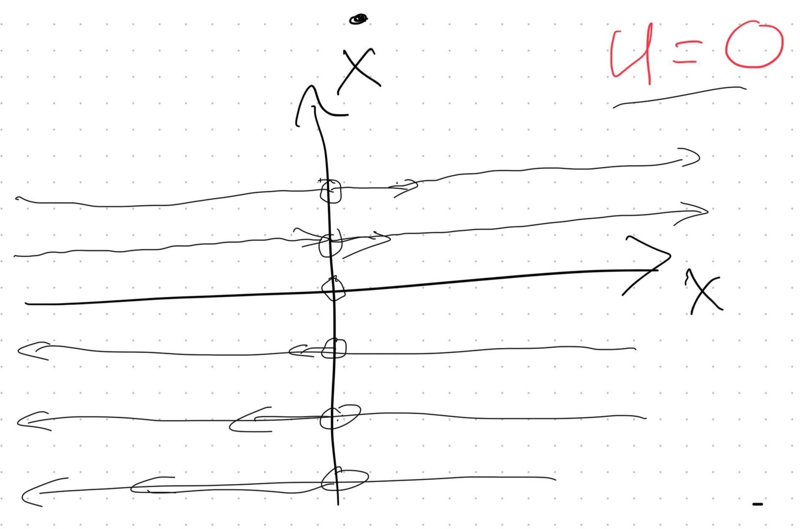
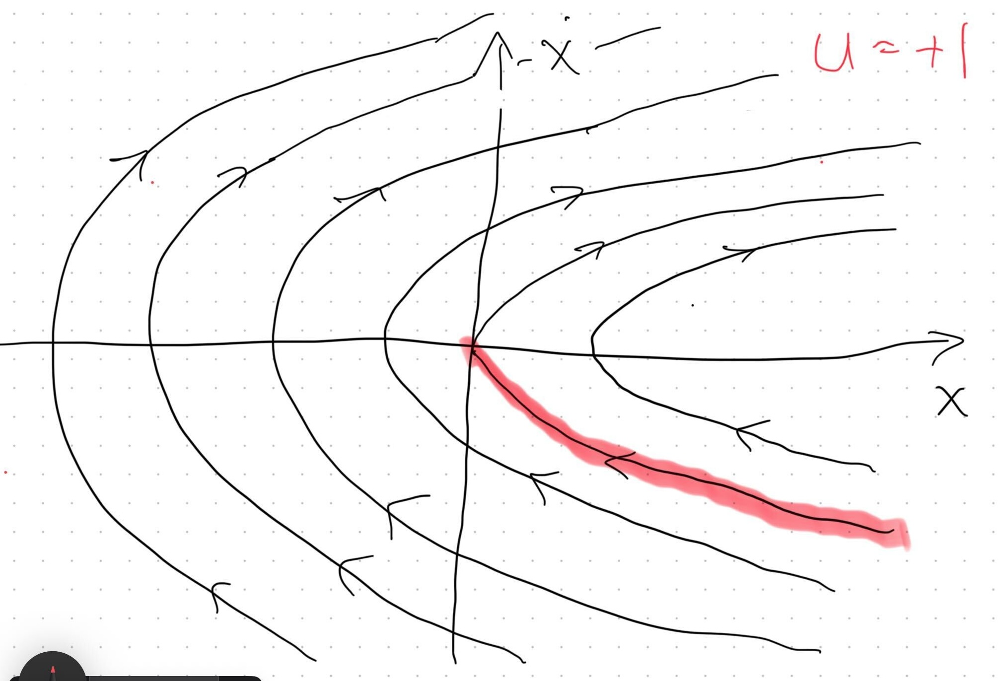
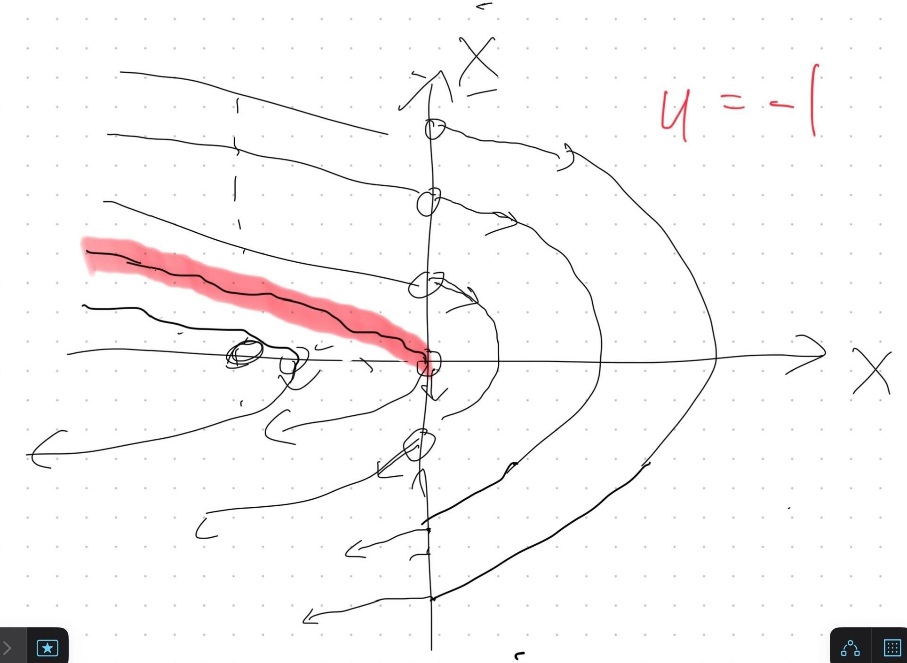

# Robotic Control

Distinct from planning, robot control indicates the problem of determining instantaneous control actions from instantaneously observed states $u_t = \pi(x_t)$. We may or may not deliberate about a long horizon behavior in order to come up with $\pi$, but when it comes to applying the function to run the robot, it is meant to be a "pause and deliberate" but rather an "act now, act fast" sort of outcome. However, as we'll see, computing the form, weights, code or structure of $\pi$ could still take plenty of deliberation, only it should happen in advance, or between episodes, etc.

## Example Control Problems

1) The block on ice is a unit mass object sliding without friction on the x line. Its control goal is to be at rest at $x=0$, but it is a real physical object and moves with some momentum, having acceleration coupled to the force applied, $\ddot{x} = u$, $\dot{x} = \dot{x}(0) + ut$ and $x = x(0) + \dot{x}(0)t + ut^2$ (by integration in time). 

2) The friction-less pendulum system is one which only feels forces from gravity around its single attachment point. Leverage traslates the gravitational force into a torque, $-mlg\sin(\theta)$, for mass $m$ and length, $l$. Balancing this with the 2nd form definition of torque, change in angular momentum, $\frac{dL}{dt}$, and writing out the angular momentum, $L=r \times p = ml^2\frac{d\theta}{dt}$ lets us take the derivative $\frac{dL}{dt} = ml^2\frac{d^2\theta}{dt^2}$. We can equate the two formulas for torque: $-mlg\sin(\theta) = ml^2\frac{d^2\theta}{dt^2}$ and find the overall motion equations $\frac{d^2\theta}{dt^2} + \frac{g}{l}\sin(\theta) = 0$. We might be familiar with the motion of a pendulum swinging slowly near it's downward point. When we have a "small angle", we can assume $\sin(\theta) = \theta$, which simplifies our equations to $\frac{d^2\theta}{dt^2} + \frac{g}{l}\theta = 0$. These are now equivalent to a mass oscillating on a simple spring, with a sinusoidal state trajectory in time. How about the full non-linear pendulum's time trajectories? They are not easy to write out in general, as we can see by the behavior of the phase-space diagram:

## Taking Control of the Phase Space

The fact that a physical dynamic system moves in time following the rules of its motion equations (visualized by the phase space), is kind of inconvenient when working with them, but we must embrace it and come up with ways for our robot's controllers, $u=\pi(x)$ to move the system as we desire. A first strategy can be direct analysis (by hand) of the phase space.

In example one, our block on ice can be made more interesting by limiting the controls possible to the range $[-1,1]$ and seeking a control strategy that reaches the goal at $(0,0)$ in as little time as possible (and then stay there forever). We can either accelerate to the left $u=-1$, passively drift $u=0$ or accelerate to the right $u=+1$. Each of these motions will yield a different phase space, and by mastering the three and making smart choices about where to apply each value of $u$, we can directly engineer good behavior.

The three phase plots look as follows:

Notice that the $u=0$ choice does not exert any control over the system. It is simply continuing on whatever initial $\dot{x}$ path it began on.

Both $u=+1$ and $u=-1$ options exert a quadratic form (de/ac)celeration on the system. In one half-plane they slow-down and another speed-up the block. If we continuously apply the same control, the block will always eventually shoot off to infinity in the positive or negative direction.

### Merging the Controls, Bang-Bang Analysis

The key to useful actions in this system is to note that there is one quadratic in each of the $+/-1$ cases that exactly reaches the goal at the origin of $x=0$ and $\dot{x}=0$. These are highlighted in red in the diagrams. If we could ever be exactly on either red $x/\dot{x}$ trajectory, we would have a nice (optimal?) option to solve our control problem, that is simply applying the indicated control while we follow the red line, and swapping to $u=0$ exactly at the goal.

How can we take this 1-D insight embedded in the phase plane to make a solution everywhere? We need to compare and intersect the quadratics from the $u=+1$ and $u=-1$ cases. Notice that everything "below" the two red quadratics can be positively accelerated to follow a quadratic in the $u=+1$ case, and every one of those will intersect with the $u=-1$ quadratic in the top-left quadrant somewhere. Symmetrically, whenever we are above the two quadratics, there are $u=-1$ paths that negatively accelerate the block until it hits the $u=+1$ critical (red) quadratic in the bottom right quadrant.

Let's put this together: we can make a global solution up from:

- Whenever we are above the critical curve, apply control $u=-1$ until we meet the $u=+1$ curve, then switch.
- Whenever we are below the critical curve, apply control $u=+1$ until we meet the $u=-1$ curve, then switch.
- On either critical curve, apply the indicated control to follow the path towards the goal at $(0,0)$.
- Whenever we are at the goal, apply $u=0$, stop and complete the task.

The resulting phase space when acting with these rules looks like this:

This control method is called **Bang-Bang** because it is made up of only maximal controls and switches immediately. There is never a case where we apply $u=0.5$ or any other intermediate control.

### Thm: Bang-Bang Control is Optimal for the Minimum Time Block on Ice Problem

We can do some time integration analysis here, considering ways that one could reach from a non-zero $x$ towards zero. 
- If we are at a point such that we cannot "stop in time", then any acceleration that causes further "overshooting" is wasted effort and time. We will always have to stop and turn around eventually and out of all the $\dot{x}=0$ positions, we'd like to be at the one as close to the goal as possible. 
- If we are at a point where we need to speed up, move towards the goal and slow down (such as any point with $\dot{x}=0$ or simply away from the critical lines), we can compare doing this as fast as possible to other options like gaining a little speed and coasting, following sub-critical quadratics and more. All of these will have less than or equal velocity to the critical Bang-Bang motion of accelerating to the critical line and then decelerating perfectly to the goal. So, they waste time.

Overall, any non Bang-Bang motion can be ruled out as taking too long with the correct application of this basic argument (it either follows a path through position-space that's too long, or it follows the right positions too slowly.)